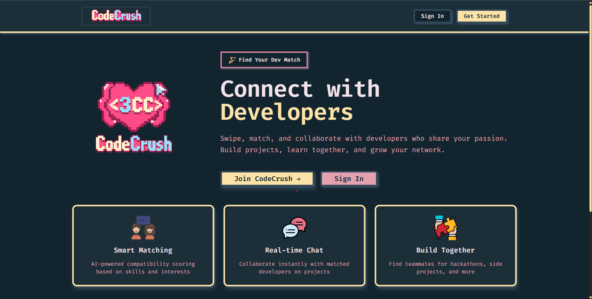

# CodeCrush

CodeCrush is a full-stack dating app for developers with swipe-style discovery, real-time chat, and AI-powered compatibility.

## Landing Page



## Highlights

- Developer-focused profiles and onboarding
- Match flow with requests, accepts, and rejects
- Real-time chat via Socket.io
- AI compatibility scoring (OpenAI)
- JWT auth with secure cookies

## Tech Stack

- Frontend: React, Vite, Tailwind CSS, React Router, Socket.io client
- Backend: Node.js, Express, MongoDB, Mongoose, Socket.io
- Integrations: Cloudinary, OpenAI

## Quick Start

1. Install dependencies:

   ```bash
   cd backend && npm install
   cd ../frontend && npm install
   ```

2. Create `backend/.env`:

   ```env
   PORT=8000
   CLIENT_URL=http://localhost:5173
   MONGODB_URI=your_mongodb_uri
   JWT_SECRET=your_jwt_secret
   CLOUDINARY_CLOUD_NAME=your_cloud_name
   CLOUDINARY_API_KEY=your_api_key
   CLOUDINARY_API_SECRET=your_api_secret
   OPENAI_API_KEY=your_openai_api_key
   ```

3. Run the app:

   ```bash
   cd backend && npm run dev
   cd ../frontend && npm run dev
   ```

## Scripts

- Backend: `npm run dev`, `npm run seed`
- Frontend: `npm run dev`, `npm run build`, `npm run preview`, `npm run lint`
